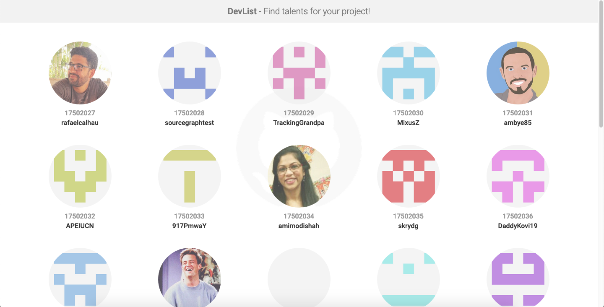
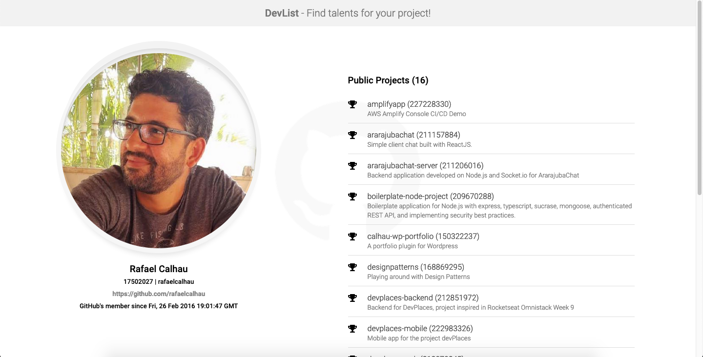

[](https://standardjs.com)
[](https://opensource.org/licenses/MIT)

# DevList

Front-end app built with Next.js that shows awesome devs from Github :)
https://devlist.calhau.now.sh




## Installation

1. Clone the project

```bash
$ git clone https://github.com/rafaelcalhau/devlist-frontend.git devlist-web
```

2. Navigate to the project

```bash
$ cd devlist-web
```

3. Install the dependencies

```bash
$ yarn install # or npm install
```

## Usage on development
Run the application on your local enviroment
    
```bash
$ yarn dev # or npm run dev
```

## Build for production and usage

```bash
$ yarn build # or npm run build
$ yarn start # or npm run start
```

## Test

```bash
# unit tests
$ yarn test # or npm run test

# test coverage
$ yarn test:cov # or npm run test:cov
```

## Stay in touch

- Author - [Rafael Calhau](https://github.com/rafaelcalhau)
- Website - [Calhau.me](https://calhau.me)
- LinkedIn - [Profile](https://www.linkedin.com/in/rafaelcalhau)

## License

[MIT licensed](LICENSE).